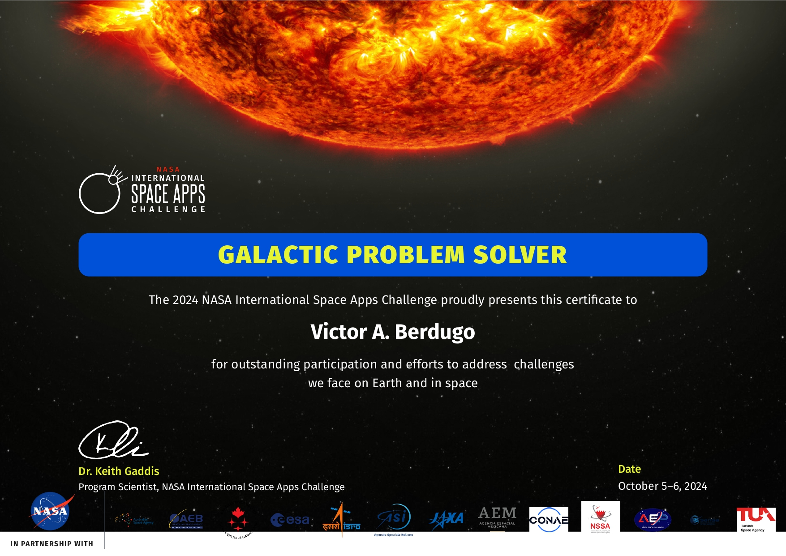

# VisioHarmony

## Overview

VisioHarmony is a unique application that combines image processing and sound generation to create an immersive audio-visual experience. The application is designed to load FITS files, commonly used in astronomy, and analyze the color distribution within the image to generate corresponding musical tones.

## Features

- **FITS File Support**: Open and process FITS files from the James Webb Space Telescope.
- **Color Analysis**: Analyze the image to determine the quantity of dark tones, mid-tones, and bright tones.
- **Audio Generation**: Convert the analyzed tones into audio, where dark tones correspond to bass sounds, mid-tones to medium sounds, and bright tones to high sounds, similar to the sounds of stars.

## How It Works

1. **Loading FITS Files**: The application allows users to load FITS files, enabling them to visualize astronomical data in a familiar format.
  
2. **Color Detection**: Once the FITS file is opened, the application scans the image for color information. It categorizes colors into three distinct groups:
   - **Dark Tones**: These tones are used to generate bass sounds, representing the deeper, more resonant elements of the image.
   - **Mid Tones**: Medium colors are translated into mid-range audio frequencies, adding depth to the overall sound experience.
   - **Bright Tones**: Bright colors, akin to stars, are transformed into high-frequency sounds, creating an uplifting and bright auditory experience.

3. **Creating Music**: The final output is a musical piece that reflects the visual information of the loaded FITS file, providing users with a captivating way to experience astronomical images.

## Getting Started

To run VisioHarmony, follow these steps:

1. **Download the ZIP File**: Download the ZIP file containing the application.

2. **Extract the ZIP**: Unzip the downloaded file to access its contents.

3. **Install the APK**: Locate the APK file in the extracted folder and install it on your Android device. You may need to enable installation from unknown sources in your device settings.

4. **Launch the Application**: Once installed, open the application and load your FITS files!

## Contributing

Contributions are welcome! If you would like to contribute to VisioHarmony, please fork the repository and submit a pull request.
